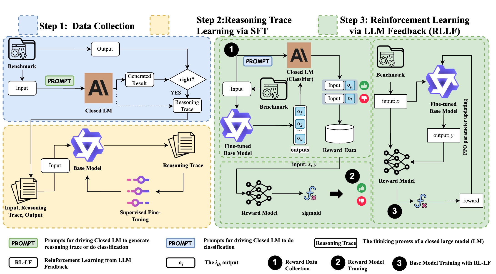

# REPAIRITY: Enhancing Open-Source LLMs for Code Tasks

REPAIRITY is an approach for enhancing open-source Large Language Models (LLMs) to achieve performance comparable to state-of-the-art closed-source LLMs on program repair and other code-related tasks. This implementation focuses on the Qwen2.5-Coder-7B model and the BigCodeBench dataset.

## Project Structure

```
TrustCode/
├── src/
│   ├── training/            # SFT model training scripts
│   │   ├── qwen_sft.py      # Qwen training on BigCodeBench
│   │   └── swebench_sft.py  # Training on SWE-bench
│   ├── evaluation/          # Model evaluation scripts
│   │   ├── qwen_eval.py     # Evaluation on BigCodeBench
│   │   ├── swebench_eval.py # Evaluation on SWE-bench
│   │   └── repairity_eval.py # REPAIRITY-specific evaluation
│   ├── rl/                  # RLLF (Reinforcement Learning with LLM Feedback)
│   │   ├── preference_collector.py # Collects LLM preferences
│   │   ├── train_reward_model.py   # Trains reward model
│   │   └── ppo_training.py         # PPO fine-tuning
│   ├── data_processing/     # Data processing scripts
│   │   └── claude_data_collector.py # Collects reasoning traces from Claude
│   ├── utils/               # Utility functions and tools
│   └── main.py              # Main entry point for the project
├── configs/
│   ├── sft/                 # Config files for SFT
│   └── rl/                  # Config files for RL
├── data/                    # Data directory
│   ├── test/                # Test datasets
│   └── training_examples/   # Sample training examples
├── docs/                    # Documentation
│   └── repairity_training.md # Detailed REPAIRITY training guide
├── scripts/                 # Utility scripts
│   ├── train_qwen.sh        # Script to run training
│   └── inference_demo.py    # Demo script for inference
├── train_qwen_with_claude.py # Script for training with reasoning strategies
└── requirements.txt         # Project dependencies
```

## Methodology

REPAIRITY consists of three primary steps:

1. **Data Collection for SFT**: Extract high-quality examples and reasoning traces from closed-source LLMs (like Claude 3.7)
2. **Reasoning Trace Learning**: Supervised fine-tuning to teach open-source models both reasoning processes and solutions
3. **Reinforcement Learning with LLM Feedback (RL-LF)**: Using closed-source LLMs as judges for preference-based training

## Setup

```bash

# Create and activate conda environment
conda create -n REPAIRITY python=3.9
conda activate REPAIRITY

# Install dependencies
pip install -r requirements.txt
```

> **Note**: If you encounter errors with the `logging` package, edit requirements.txt to remove it, as logging is already part of Python's standard library.

## Usage Guide for BigCodeBench

### 1. Data Collection from Claude 3.7

First, collect reasoning traces and solutions from Claude 3.7:

```bash
# Collect data with Claude 3.7
python -m src.main collect-data --num_examples 100 --batch_size 10

# or directly run claude_data_collector.py
python src/data_processing/claude_data_collector.py --num_examples 100 --batch_size 10 --output_dir ./data

# For more options
python -m src.main collect-data --help
```

This will:
- Load examples from the BigCodeBench dataset
- Send them to Claude 3.7 with prompts designed to elicit reasoning traces
- Extract solutions and structured reasoning sections
- Save the results to a JSON file in the specified output directory

### 2. Supervised Fine-Tuning (SFT)

#### Standard SFT

Train the Qwen-7B model using the standard BigCodeBench dataset:

```bash
# Using standard BigCodeBench data
python -m src.main sft --model qwen-7b --output_dir ./qwen-7b-finetuned --batch_size 4 --num_epochs 3
```

#### REPAIRITY Reasoning Trace ability Training

Train with Claude reasoning traces using different reasoning strategies:

```bash
# Train with all three reasoning strategies
./train_qwen_with_claude.py --strategies explicit cot alternating --epochs 3 --batch_size 4

# Or train with a specific strategy
python -m src.main sft --model qwen-7b \
  --claude_data_path ./data/claude_reasoning_traces_v0.1.4_100.json \
  --reasoning_strategy explicit \
  --output_dir ./models/qwen_repairity_explicit
```

Available reasoning strategies:
- `explicit`: Clear separation between reasoning approach and code solution
- `cot`: Step-by-step chain-of-thought reasoning process
- `alternating`: Interleaved approach explanation with code segments
- `none`: Just the solution code (baseline)

The training process:
- Formats training examples with the selected reasoning strategy
- Applies LoRA fine-tuning to Qwen-7B
- Saves model checkpoints and test data for evaluation

#### Model Evaluation---Automatic Evaluation (Recommended)

Automatically detect and evaluate the latest trained model:

```
<!-- Standard vs. REPAIRITY-specific Evaluations
The two evaluations measure different aspects of your model's capabilities:
Standard Benchmark Evaluation
What it measures: Code correctness and functional performance
How it works: Runs model solutions against test cases
Metrics: Pass@k, execution success rates, compilation rates
Focus: "Does the code work correctly?"
Implementation: Uses the BigCodeBench evaluation pipeline
Script path: src/main or src/evaluation/qwen_eval.py

REPAIRITY-specific Evaluation
What it measures: Quality of reasoning and slow-thinking abilities
How it works: Compares model's reasoning approach with Claude's traces
Metrics: Reasoning quality, problem decomposition, approach explanation
Focus: "Can the model explain its thought process effectively?"
Implementation: Uses the held-out Claude test data
Script path: src/evaluation/repairity_eval.py -->


1. ./scripts/evaluate_latest.py
What it does: Runs BOTH standard benchmark AND REPAIRITY-specific evaluations
Model selection: Automatically finds the latest trained model
Key benefit: Complete evaluation with no manual path specification needed
2. ./scripts/run_eval.py --model_path ./models/qwen_repairity_[TIMESTAMP]_[STRATEGY]
What it does: Runs ONLY standard benchmark evaluation
Model selection: Requires manual specification of exact model path
Key benefit: Robust handling of command-line interface issues
Focus: General code correctness and performance metrics
3. ./scripts/evaluate_latest.py --eval_type repairity
What it does: Runs ONLY the REPAIRITY-specific evaluation
Model selection: Automatically finds the latest trained model
Key benefit: Focuses specifically on reasoning capabilities
Focus: Evaluates slow-thinking abilities using Claude test data

```


```bash
# Evaluate the latest model with both standard and REPAIRITY-specific evaluation
./scripts/evaluate_latest.py

# Evaluate only the latest model with a specific strategy
./scripts/evaluate_latest.py --strategy explicit

# Run only standard benchmark evaluation
./scripts/evaluate_latest.py --eval_type standard
or
./scripts/run_eval.py --model_path ./models/qwen_repairity_[TIMESTAMP]_[STRATEGY]
# Run only REPAIRITY-specific evaluation (reasoning trace), Uses the held-out Claude test data, Compares model outputs with Claude's reasoning traces; Focuses on slow-thinking abilities
./scripts/evaluate_latest.py --eval_type repairity
```

This script will:
1. Find the latest model based on modification time
2. Automatically detect the reasoning strategy
3. Create a timestamped output directory for results
4. Run both standard and REPAIRITY-specific evaluations (by default)

#### Manual Evaluation

If you need to evaluate a specific model:

##### Standard Benchmark Evaluation

```bash
python -m src.main --model qwen-7b --model_path ./models/qwen_repairity_[TIMESTAMP]_[STRATEGY] --output_dir ./eval_results_[STRATEGY]
```

##### REPAIRITY-Specific Evaluation

```bash
python src/evaluation/repairity_eval.py --model_path ./models/qwen_repairity_[TIMESTAMP]_[STRATEGY] --claude_test_path ./data/test/claude_traces_test_set_[STRATEGY].json
```

These evaluations produce:
- Detailed results in JSON format
- Success rate and other metrics
- Examples of reasoning traces and solutions

####  Running Inference

Test your fine-tuned model on BigCodeBench examples:

```bash
# Basic inference
python scripts/inference_demo.py --model_path ./models/qwen_repairity_[TIMESTAMP]_[STRATEGY] --num_samples 5

# Extended inference with more examples
python scripts/inference_demo.py --model_path ./models/qwen_repairity_[TIMESTAMP]_[STRATEGY] --num_samples 10 --max_length 2048 --temperature 0.2
```

Results will be saved to `inference_results/bigcodebench_inference.json`.


## 3. Reinforcement Learning Implementation

Our RL implementation consists of three key components:

### Binary Feedback RLLF

We transform traditional pairwise preferences into binary feedback:

```bash
# 1. Collect binary feedback
python src/data_processing/preference_collector.py \
  --model_name "Qwen/Qwen2.5-Coder-7B-Instruct" \
  --output_dir "./data/preferences"

# 2. Train binary reward model
python src/training/train_binary_reward_model.py \
  --model_name "codellama/CodeLlama-2b-hf" \
  --train_data "./data/preferences/train.json" \
  --output_dir "./models/reward_model"

# 3. Run RLLF training
python src/training/train_rllf.py \
  --model_name "Qwen/Qwen2.5-Coder-7B-Instruct" \
  --reward_model_path "./models/reward_model" \
  --output_dir "./models/rllf_qwen"
```

The binary feedback approach:
1. Generates one solution per input using Qwen
2. Has Claude evaluate each solution as "GOOD" or "BAD"
3. Trains a binary classifier reward model
4. Uses PPO to optimize against binary rewards

### Evaluation

We provide scripts to evaluate the latest trained models:

```bash
# Evaluate latest model
python src/evaluation/evaluate_latest.py

# Run specific evaluation
python src/evaluation/run_eval.py \
  --model_path "./models/qwen_repairity_[TIMESTAMP]"
```

The evaluation:
1. Uses 114 hard test examples from BigCodeBench v0.1.4
2. Measures Pass@1 performance
3. Analyzes reasoning quality
4. Compares against baseline Qwen

```bash
python src/evaluation/qwen_eval.py \
  --model_path "Qwen/Qwen2.5-Coder-7B-Instruct" \
  --dataset_version "v0.1.4" \
  --max_test_samples 114 \
  --show_reasoning \
  --output_dir "./evaluation_results/bigcodebench_base"
```

```bash
python src/evaluation/qwen_eval.py \
  --model_path "models/qwen_repairity_20250330_011532_alternating_alternating" \
  --dataset_version "v0.1.4" \
  --max_test_samples 114 \
  --show_reasoning \
  --output_dir "./evaluation_results/bigcodebench_sft"
```

```bash
python src/evaluation/qwen_eval.py \
  --model_path "models/preference-ft-qwen-7b" \
  --dataset_version "v0.1.4" \
  --max_test_samples 114 \
  --show_reasoning \
  --output_dir "./evaluation_results/bigcodebench_rllf"
```
## Implementation Details

- **Hardware Requirements**: H100 GPUs with DeepSpeed ZeRO-2 for optimal performance
- **Parameter-Efficient Fine-Tuning**: LoRA (rank=8, alpha=16, dropout=0.05)
- **Training Configuration**: 
  - 3 epochs
  - Learning rate 2e-5
  - Effective batch size of 8-16
  - Context window: 2048 tokens
  - FP16 precision for training
- **Inference Settings**: 
  - Temperature 0.2 for deterministic evaluation
  - Higher temperatures (0.7-0.9) for diversity in RL preference collection
- **RL-LF Implementation**:
  - Preference collection using Claude-Sonnet3.7
  - CodeLlama-7b reward model with 85% preference accuracy
  - PPO with KL coefficient 0.1
 

## Additional Documentation

For detailed information about the REPAIRITY approach and implementation details, see:
- [REPAIRITY Training Guide](./docs/repairity_training.md): Comprehensive guide on implementing slow-thinking abilities

## Monitoring and Debugging

Monitor training progress:

```bash
# View tensorboard logs
tensorboard --logdir=tensorboard_logs

# Check evaluation metrics
cat eval_results/evaluation_summary.json
```
